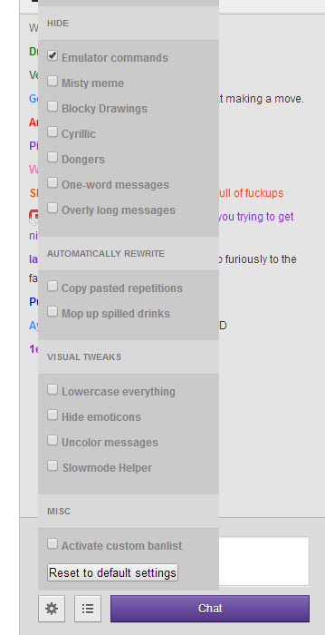

# Twitch.TV Chat Filter

A Javascript userscript to filter chat commands and other spam from the chat on the [Twitch Plays Pokemon stream](http://www.twitch.tv/twitchplayspokemon)

## Using the script as a JavaScript bookmark

Fast and lightweight way to run the script.

1. Go to the bookmark menu of your browser and add a new bookmark with the title of your choice.

2. Copy the following snippet and paste it into the URL-Field: `javascript:(function(){document.body.appendChild(document.createElement('script')).src='http://jpgohlke.github.io/twitch-chat-filter/chat_filter.user.js';})();`

3. Save the Bookmark.

4. From now on, you can just click on that bookmark when you have the TPP-Tab open to enable the script.

## Installing the script using Greasemonkey (Firefox)

Installing the userscript via Greasemonkey will automatically run it everytime you visit the TPP stream.

1. Install the [Greasemonkey extension](https://addons.mozilla.org/en-US/firefox/addon/greasemonkey/) for Firefox.

2. Click this link to navigate to the script URL: http://jpgohlke.github.io/twitch-chat-filter/chat_filter.user.js

3. Greasemonkey will detect the userscript and ask what to do with it. Tell it to "Install" the script.

4. Refresh the page TPP stream page.

## Installing the script using Tampermonkey (Chrome)

Tampermonkey lets you install userscripts in Chrome, similarly to how Greasemonkey does it in Firefox.

1. Install the [Tampermonkey extension](https://chrome.google.com/webstore/detail/tampermonkey/dhdgffkkebhmkfjojejmpbldmpobfkfo/related) for Chrome.

2. Click this link to navigate to the script URL: http://jpgohlke.github.io/twitch-chat-filter/chat_filter.user.js

3. Tampermonkey will detect the userscript and will open a new tab. Click on `Install to Tampermonkey` and click Ok.

4. Refresh the page TPP stream page.

## Run the script via the console (no extensions needed)

If you don't want or can't install one of the previously mentioned browser extensions, one possibility is to run the script via the developer console. However, you will need to rerun the script every time you refresh the stream.

1. On the TPP stream page, open your broser's developer console.
    * On Firefox, press `Ctrl` + `Shift` + `K`
    * On Chrome, press `Ctrl` + `Shift` + `J`
    * On Safari, press `Ctrl` + `Alt` + `I`
    * On IE9+, press `F12`
    * On Opera, press `Ctrl` + `Shift` + `I`
    * If you are having trouble opening your console, try reading the in depth explanation [here](http://webmasters.stackexchange.com/questions/8525/how-to-open-the-javascript-console-in-different-browsers)

2. Copy the following snippet and paste it into the developer console on the TPP page: `javascript:(function(){document.body.appendChild(document.createElement('script')).src='http://jpgohlke.github.io/twitch-chat-filter/chat_filter.user.js';})();`

3. Press `Enter` to run the code.

## Update Log

Version 2.4 (2014/04/12)

- New twitch.tv layout: settings menu is now together with Twich's own settings menu.
- Slowmode helper does not block sending messages anymore and can be turned off.
- Made the command filter recognize any non-alphabetic separator.
- Removed URL and Spam filters
- "Hide emoticons" command now fully hides messages that only contained emoticons
- Coordinate inputs for touch screen are now filtered (e.g., 291,372)

Version 2.3 (2014/03/28)

- Removed custom ignored-user list.
- More specific donger detection.
- Recognize compound commands (b+left)

Version 2.2 (2014/03/21)

* Improved style of custom filter lists
* Activated filters are now saved between sessions
* Better handling of delays between messages
* Information on script displayed upon loading

Version 2.1 (2014/03/07)

* Fixed userscript support
* Added filter for overly long messages
* Added "no emoticons" restyler
* Added "no colored messages" restyler

Version 2.0 (2014/03/06)

* Countdown timer on the chat button to show slow mode warnings
* Added custom filtering option

Version 1.9 (2014/03/03)

* Updated script to work with both old and new version of the twitch chat
